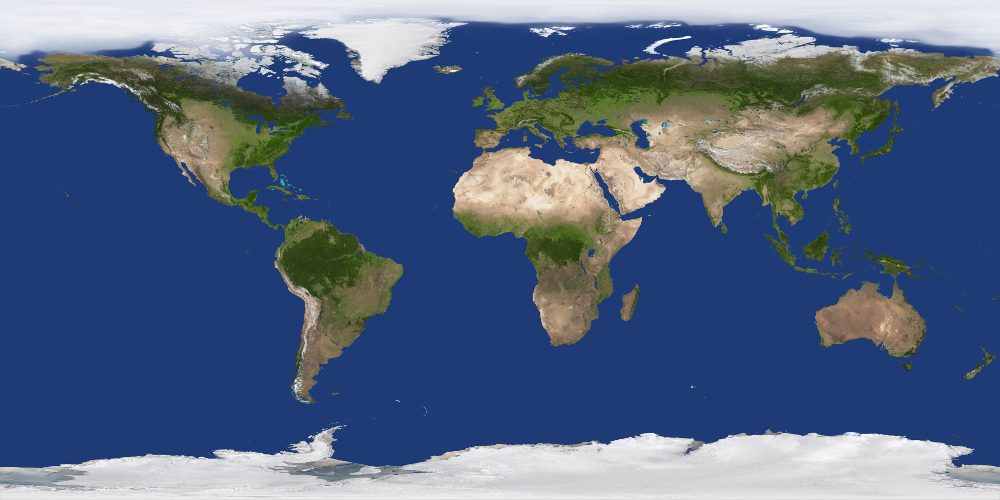

# Satellite Tracker 🚀

## Overview
Satellite Tracker is a 3D visualization application built using Qt Quick 3D and C++. It renders the Earth along with satellite models in a real-time interactive 3D environment. The project demonstrates integration between C++ backend logic and QML-based UI, along with modern 3D rendering using Qt.

---

## Features
- 3D Earth visualization using Qt Quick 3D  
- Satellite rendering and positioning  
- Interactive camera controls (zoom, rotate, pan)  
- Real-time scene rendering  
- Integration of C++ backend with QML frontend  
- Cross-platform desktop application  

---

## Tech Stack
- C++  
- QML (Qt Quick)  
- Qt 6 (Qt Quick 3D)  
- CMake  

---

## Screenshots

---

## Project Structure
- `main.cpp` – Entry point of the application  
- `SatelliteTracker.cpp / SatelliteTracker.h` – Backend logic  
- `Main.qml` – UI and 3D scene setup  
- `CMakeLists.txt` – Build configuration  
- `earth.jpg`, `earth_night.jpg` – Textures for Earth rendering  
- `satellite.png` – Satellite asset  

---

## Build Instructions

1. Clone the repository:
